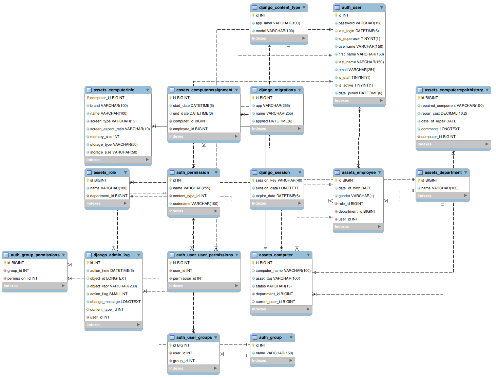

# IT Asset Management System

This project was conceived in 2023 when I was an attachee in an IT department of one of the government companies in Nairobi. The issue that I immediately saw was that computers had maintenance logs kept in files and if you were tasked with a scheduled maintenance on teh same computer, which involved cleaning the computer on the outside as well as running diagnostic software such as disk utilities to make sure the computer was in an optimal operating condition, you had to manually look for the computer's log in a heap of files which also contained duplicate entries of the same computer. That proved to be inefficient and as such, I conceived this idea.

Below, is the ERD Diagram for the schema used in this project.

> [!NOTE]
> This project was conceived back in 2023 when I was attached to a certain Company as an IT intern. Back then, I was still learning the basics of programming but I was curious as to how technology could be used to automate workflow in a dynamic real worl environment.
> It came a time for a scheduled maintenance in the company and we were tasked to do hardware maintenance. This involved going to each deparment and asking the user to bring the laptop to the IT deparment. In the deparment, we were tasked with looking for the computer maintenance history logs and updating them as required.
> The challenge became that some logs were missing as there was no clear accountability in the way the logs were stored. This resulted in us diving through files that dated back to 2016. There was no hierarchy which further complicated matters and when the superiors were consulted, they just printed new maintenance logs and the maintenance was marked as done and dusted.
> This to date was at the back of my mind and became an inspiration for me when I heard about the capstone project.

> [!IMPORTANT]
> The system works as follows:
> 1. The Admin Interface is used to create a User from the default Django User model. The user is then made to be an employee by extending the User model with a custom model.
> 2. The Admin interface is also used to create a new computer and the computer is then assigned to the employee. After assigning to the employee, the computer's repair history is then maintained and when a user logs in to their dashboard, they see their computer's repair history and the cost of the repairs.
> 3. The Computer has three states; When assigned a user, its in use; When not assigned a user, it's marked as 'In Inventory'; When the computer is damaged, it's marked as 'Faulty'. A faulty computer cannot be assigned to a user.
> 4. A faulty computer cannot also be deleted by the admin but the system developer who has access to the backend, which preserves the integrity of audit logs.

## May this project inspire you to improve it as you desire.
### Yours Truly; Malvin
