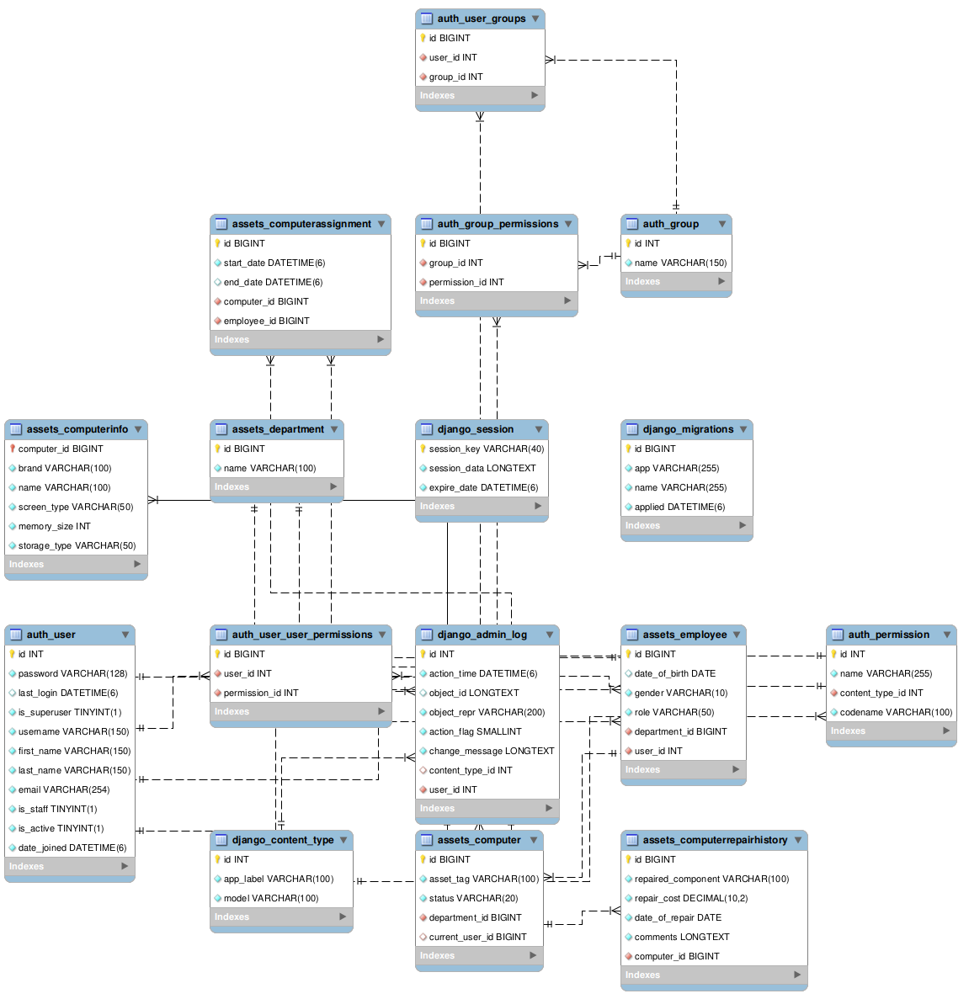

# IT Asset Management System

This project was conceived in 2023 when I was an attachee in an IT department of one of the government companies in Nairobi. The issue that I immediately saw was that computers had maintenance logs kept in files and if you were tasked with a scheduled maintenance on teh same computer, which involved cleaning the computer on the outside as well as running diagnostic software such as disk utilities to make sure the computer was in an optimal operating condition, you had to manually look for the computer's log in a heap of files which also contained duplicate entries of the same computer. That proved to be inefficient and as such, I conceived this idea.

Below, is the ERD Diagram for the schema used in this project.

